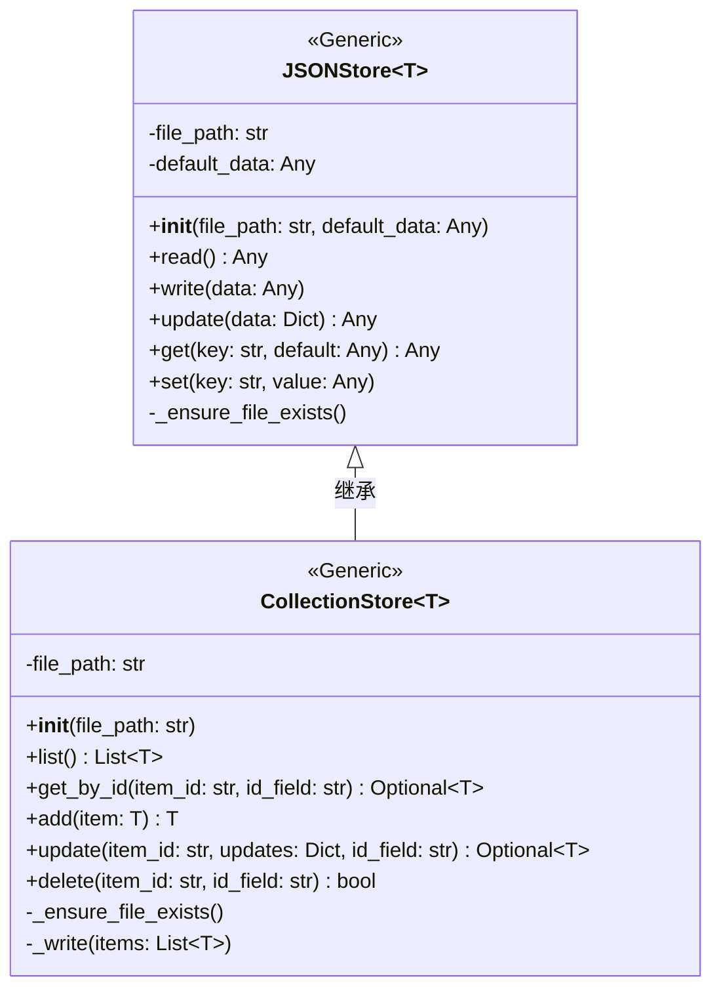
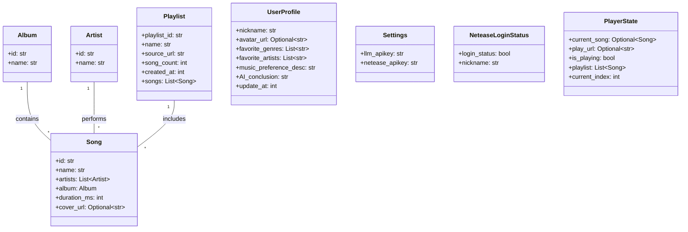
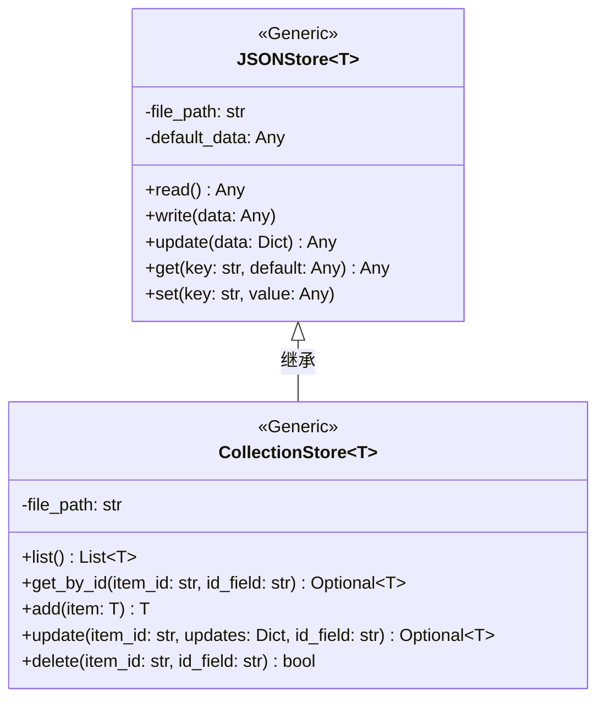
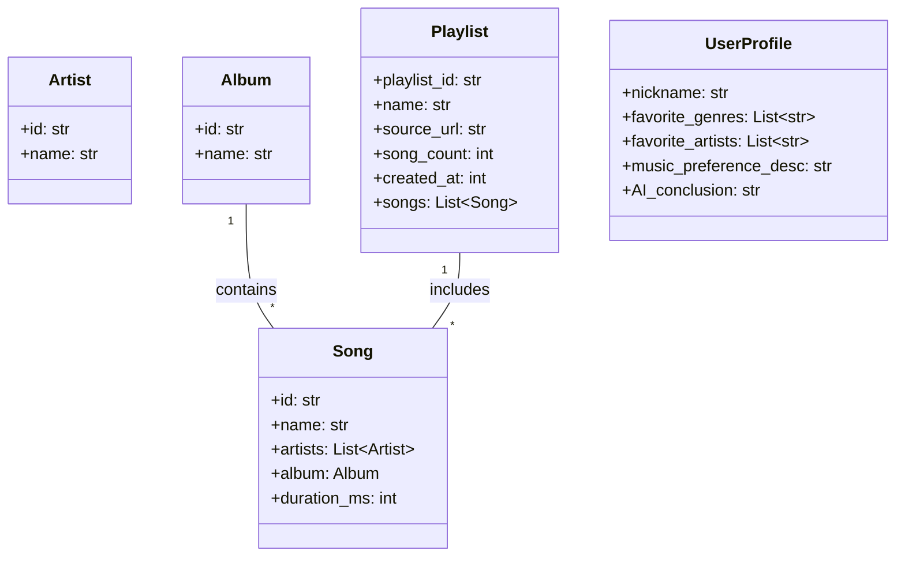
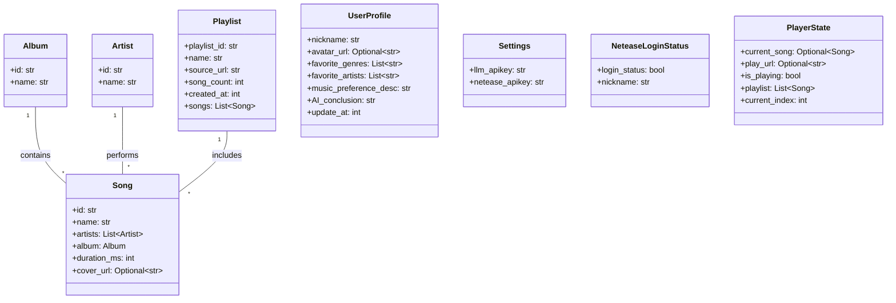

# HTTP接口设计报告

## 1. HTTP模块概述

### 1.1 模块组成

HTTP模块位于 `backend/api/http/` 目录下，包含以下文件：

| 文件 | 功能说明 |
|------|----------|
| `__init__.py` | 统一导出所有路由模块，便于主应用注册 |
| `init_router.py` | 系统初始化接口，返回全局数据快照 |
| `setting_router.py` | 系统设置接口，管理API密钥等配置 |
| `netease_router.py` | 网易云音乐接口，处理登录和状态查询 |
| `playlist_router.py` | 歌单管理接口，支持CRUD操作 |
| `user_router.py` | 用户信息接口，管理用户资料和音乐偏好分析 |

### 1.2 模块作用

HTTP模块是SoulChord后端系统的**对外交互层**，基于FastAPI框架实现，主要职责包括：

1. **统一接口入口**：作为前端与后端数据交互的唯一入口，提供RESTful API服务
2. **数据流转控制**：接收前端请求，调用数据存储层（JSONStore）完成数据读写，返回统一格式的响应
3. **参数校验**：使用Pydantic模型进行请求参数的类型校验和验证
4. **业务逻辑封装**：将各功能模块的业务逻辑封装为独立的接口，便于维护和扩展
5. **状态管理**：管理系统配置、用户登录状态、播放状态等全局数据

### 1.3 架构设计

```
┌─────────────────────────────────────────────────────────────┐
│                        前端应用                              │
└──────────────────────────┬──────────────────────────────────┘
                           │ HTTP请求
┌──────────────────────────▼──────────────────────────────────┐
│                    FastAPI应用                              │
│  ┌──────────┐ ┌──────────┐ ┌──────────┐ ┌──────────┐       │
│  │ init     │ │ setting  │ │ netease  │ │playlist  │       │
│  │ router   │ │ router   │ │ router   │ │ router   │       │
│  └────┬─────┘ └────┬─────┘ └────┬─────┘ └────┬─────┘       │
│  ┌────┴────────────────────────────────────┬────────┐      │
│  │           user_router                   │        │      │
│  └──────────────────┬──────────────────────┘        │      │
└─────────────────────┼───────────────────────────────┘      │
                      │ 数据读写
┌─────────────────────▼───────────────────────────────────────┐
│                    数据存储层（JSONStore）                   │
│  settings.json | netease.json | user_profile.json          │
│  playlists.json | player.json                              │
└─────────────────────────────────────────────────────────────┘
```

---

## 2. 功能模块类图

### 2.1 数据存储层类图



### 2.2 数据模型类图



### 2.3 路由模块关系图

```mermaid
classDiagram
    class FastAPI {
        +include_router(router)
    }

    class APIRouter {
        +get(path)
        +post(path)
        +put(path)
        +delete(path)
    }

    class InitRouter {
        +GET /api/init
    }

    class SettingRouter {
        +GET /api/settings
        +PUT /api/settings
    }

    class NeteaseRouter {
        +POST /api/netease/login
        +GET /api/netease/status
    }

    class PlaylistRouter {
        +POST /api/playlist/import
        +GET /api/playlist/list
        +GET /api/playlist/{playlist_id}
        +PUT /api/playlist/{playlist_id}
        +DELETE /api/playlist/{playlist_id}
    }

    class UserRouter {
        +POST /api/user/analyze
        +GET /api/user/profile
        +PUT /api/user/baseinfo
    }

    FastAPI --> InitRouter : includes
    FastAPI --> SettingRouter : includes
    FastAPI --> NeteaseRouter : includes
    FastAPI --> PlaylistRouter : includes
    FastAPI --> UserRouter : includes

    InitRouter --> APIRouter : extends
    SettingRouter --> APIRouter : extends
    NeteaseRouter --> APIRouter : extends
    PlaylistRouter --> APIRouter : extends
    UserRouter --> APIRouter : extends
```

---

## 3. 功能实现关键代码片段

### 3.1 应用入口

**文件**: [main.py](file:///e:/Code/gitRepo/SoulChord/SoulChord/backend/main.py)

```python
from fastapi import FastAPI
from backend.api.http import (
    init_router,
    setting_router,
    netease_router,
    playlist_router,
    user_router,
)

app = FastAPI(title="SoulChord Backend API", version="1.0")

app.include_router(init_router)
app.include_router(setting_router)
app.include_router(netease_router)
app.include_router(playlist_router)
app.include_router(user_router)
```

**说明**: 主入口文件初始化FastAPI应用，并注册所有路由模块，实现统一的接口入口管理。

### 3.2 路由模块统一导出

**文件**: [__init__.py](file:///e:/Code/gitRepo/SoulChord/SoulChord/backend/api/http/__init__.py)

```python
from .init_router import router as init_router
from .setting_router import router as setting_router
from .netease_router import router as netease_router
from .playlist_router import router as playlist_router
from .user_router import router as user_router

__all__ = [
    "init_router",
    "setting_router",
    "netease_router",
    "playlist_router",
    "user_router",
]
```

**说明**: 通过统一导出机制，将所有路由模块集中管理，简化主应用的导入逻辑。

### 3.3 JSONStore数据存储基类

**文件**: [json_store.py](file:///e:/Code/gitRepo/SoulChord/SoulChord/backend/db/json_store.py#L8-L56)

```python
class JSONStore(Generic[T]):
    def __init__(self, file_path: str, default_data: Any = None):
        self.file_path = file_path
        self.default_data = default_data or {}
        self._ensure_file_exists()

    def read(self) -> Any:
        self._ensure_file_exists()
        try:
            with open(self.file_path, 'r', encoding='utf-8') as f:
                return json.load(f)
        except (json.JSONDecodeError, FileNotFoundError):
            return self.default_data.copy()

    def update(self, data: Dict[str, Any]):
        current = self.read()
        if isinstance(current, dict):
            current.update(data)
            self.write(current)
            return current
        return current
```

**说明**: JSONStore是核心数据存储类，提供基于JSON文件的读写操作，支持自动文件创建和异常处理，确保数据操作的健壮性。

### 3.4 CollectionStore集合存储类

**文件**: [json_store.py](file:///e:/Code/gitRepo/SoulChord/SoulChord/backend/db/json_store.py#L58-L109)

```python
class CollectionStore(Generic[T]):
    def get_by_id(self, item_id: str, id_field: str = 'id') -> Optional[T]:
        items = self.list()
        for item in items:
            if item.get(id_field) == item_id:
                return item
        return None

    def update(self, item_id: str, updates: Dict[str, Any], id_field: str = 'id') -> Optional[T]:
        items = self.list()
        for idx, item in enumerate(items):
            if item.get(id_field) == item_id:
                items[idx] = {**item, **updates}
                self._write(items)
                return items[idx]
        return None

    def delete(self, item_id: str, id_field: str = 'id') -> bool:
        items = self.list()
        original_count = len(items)
        items = [item for item in items if item.get(id_field) != item_id]
        if len(items) != original_count:
            self._write(items)
            return True
        return False
```

**说明**: CollectionStore继承自JSONStore，专为列表型数据提供CRUD操作，支持自定义ID字段名称，满足歌单等集合数据的管理需求。

### 3.5 系统初始化接口

**文件**: [init_router.py](file:///e:/Code/gitRepo/SoulChord/SoulChord/backend/api/http/init_router.py#L13-L31)

```python
@router.get("/api/init")
async def init():
    settings = settings_store.read()
    netease_status = netease_store.read()
    user_profile = user_profile_store.read()
    playlists = playlist_store.list()
    player_state = player_store.read()

    return {
        "code": 0,
        "msg": "ok",
        "data": {
            "settings": settings,
            "netease_status": netease_status,
            "user_profile": user_profile,
            "playlists": playlists,
            "player_state": player_state,
        },
    }
```

**说明**: 初始化接口在应用启动时返回所有全局数据，包括系统设置、网易云状态、用户资料、歌单列表和播放器状态，实现一次性数据同步。

### 3.6 设置管理接口

**文件**: [setting_router.py](file:///e:/Code/gitRepo/SoulChord/SoulChord/backend/api/http/setting_router.py#L9-L30)

```python
class SettingsUpdateRequest(BaseModel):
    llm_apikey: Optional[str] = None
    netease_apikey: Optional[str] = None

@router.put("/api/settings")
async def update_settings(request: SettingsUpdateRequest):
    updates = {}
    if request.llm_apikey is not None:
        updates["llm_apikey"] = request.llm_apikey
    if request.netease_apikey is not None:
        updates["netease_apikey"] = request.netease_apikey
    if updates:
        settings_store.update(updates)
    settings = settings_store.read()
    return {"code": 0, "msg": "ok", "data": settings}
```

**说明**: 使用Pydantic模型定义请求参数，支持可选字段的部分更新，确保接口的灵活性和安全性。

### 3.7 歌单CRUD接口

**文件**: [playlist_router.py](file:///e:/Code/gitRepo/SoulChord/SoulChord/backend/api/http/playlist_router.py)

```python
@router.post("/api/playlist/import")
async def import_playlist(request: ImportPlaylistRequest):
    playlist_id = str(uuid.uuid4())
    new_playlist = {
        "playlist_id": playlist_id,
        "name": "未命名歌单",
        "source_url": request.playlist_url,
        "song_count": 0,
        "created_at": int(time.time() * 1000),
        "songs": []
    }
    playlist_store.add(new_playlist)
    return {"code": 0, "msg": "ok", "data": new_playlist}

@router.delete("/api/playlist/{playlist_id}")
async def delete_playlist(playlist_id: str):
    success = playlist_store.delete(playlist_id, id_field="playlist_id")
    if not success:
        return {"code": 1003, "msg": "歌单不存在", "data": None}
    return {"code": 0, "msg": "ok", "data": None}
```

**说明**: 歌单接口完整实现了增删改查功能，使用UUID生成唯一ID，通过`id_field`参数指定自定义ID字段名，支持灵活的数据管理。

### 3.8 用户音乐偏好分析接口

**文件**: [user_router.py](file:///e:/Code/gitRepo/SoulChord/SoulChord/backend/api/http/user_router.py#L15-L42)

```python
@router.post("/api/user/analyze")
async def analyze_user():
    playlists = playlist_store.list()
    current_time = int(time.time() * 1000)

    genres = []
    artists = []
    for playlist in playlists:
        songs = playlist.get("songs", [])
        for song in songs:
            for artist in song.get("artists", []):
                artists.append(artist.get("name", ""))
            album = song.get("album", {})
            genres.append(album.get("name", ""))

    favorite_genres = list(set(genres))[:5]
    favorite_artists = list(set(artists))[:5]

    updates = {
        "favorite_genres": favorite_genres,
        "favorite_artists": favorite_artists,
        "music_preference_desc": "根据您的歌单分析生成的音乐偏好描述",
        "AI_conclustion": "您是一位热爱音乐的用户",
        "update_at": current_time
    }
    user_profile_store.update(updates)

    return {"code": 0, "msg": "ok", "data": {"update_at": current_time}}
```

**说明**: 用户分析接口遍历所有歌单中的歌曲，提取艺术家和专辑信息，通过去重和截取操作生成用户的音乐偏好数据，实现基于歌单的用户画像分析。

### 3.9 统一响应格式

所有接口遵循统一的响应格式：

```python
{
    "code": 0,
    "msg": "ok",
    "data": {}
}
```

| 字段 | 类型 | 说明 |
|------|------|------|
| `code` | int | 状态码，0表示成功，非0表示错误 |
| `msg` | str | 状态描述信息 |
| `data` | any | 响应数据，可为对象、数组或null |

**错误码定义**（参考前端接口契约文档）:

| 错误码 | 含义 |
|--------|------|
| 0 | 成功 |
| 1001 | 参数错误 |
| 1002 | APIKey未配置 / 网易云账号未登录 |
| 1003 | 歌单/歌曲资源不存在 |
| 2001 | LLM大模型调用失败 |
| 2002 | 工具调用失败 |
| 2003 | 请求超时 |
| 3001 | 网易云音乐服务不可用 |
| 3002 | 网易云接口请求异常 |
| 9999 | 服务内部异常 |

---

## 4. 接口与前端契约对照表

| 接口路径 | HTTP方法 | 功能描述 | 契约文档位置 |
|----------|----------|----------|--------------|
| `/api/init` | GET | 系统初始化，获取全部基础数据 | 1.1节 |
| `/api/settings` | GET | 获取服务密钥配置 | 1.2节 |
| `/api/settings` | PUT | 增量更新APIKey配置 | 1.2节 |
| `/api/netease/login` | POST | 网易云账号登录 | 1.3节 |
| `/api/netease/status` | GET | 查询网易云登录状态 | 1.3节 |
| `/api/playlist/import` | POST | 通过链接导入歌单 | 1.4节 |
| `/api/playlist/list` | GET | 查询全部歌单列表 | 1.4节 |
| `/api/playlist/{playlist_id}` | GET | 查询单个歌单详情 | 1.4节 |
| `/api/playlist/{playlist_id}` | PUT | 修改歌单基础信息 | 1.4节 |
| `/api/playlist/{playlist_id}` | DELETE | 删除指定歌单 | 1.4节 |
| `/api/user/analyze` | POST | 触发AI画像分析 | 1.5节 |
| `/api/user/profile` | GET | 查询用户画像数据 | 1.5节 |
| `/api/user/baseinfo` | PUT | 修改用户基础信息 | 1.5节 |

---

## 5. 总结

HTTP模块作为SoulChord后端系统的对外交互层，基于FastAPI框架实现了完整的RESTful API服务。通过模块化的路由设计、统一的响应格式和JSON文件存储方案，实现了轻量级、易于部署的后端服务架构。各功能模块职责清晰，接口设计规范，完全符合前端接口契约文档的要求，便于前端调用和后续功能扩展。# HTTP接口设计报告

## 1. HTTP模块概述

### 1.1 模块组成

HTTP模块位于 `backend/api/http/` 目录下，包含以下文件：

| 文件 | 功能说明 |
|------|----------|
| `__init__.py` | 统一导出所有路由模块 |
| `init_router.py` | 系统初始化接口 |
| `setting_router.py` | 系统设置接口 |
| `netease_router.py` | 网易云音乐接口 |
| `playlist_router.py` | 歌单管理接口 |
| `user_router.py` | 用户信息接口 |

### 1.2 模块作用

HTTP模块是SoulChord后端系统的对外交互层，基于FastAPI框架实现，主要职责包括：

1. **统一接口入口**：提供RESTful API服务
2. **数据流转控制**：调用数据存储层完成数据读写
3. **参数校验**：使用Pydantic模型进行请求参数验证
4. **业务逻辑封装**：将各功能模块的业务逻辑封装为独立接口
5. **状态管理**：管理系统配置、用户登录状态等全局数据

### 1.3 架构设计

```
┌─────────────────────────────────────────────────────────────┐
│                        前端应用                              │
└──────────────────────────┬──────────────────────────────────┘
                           │ HTTP请求
┌──────────────────────────▼──────────────────────────────────┐
│                    FastAPI应用                              │
│  ┌──────────┐ ┌──────────┐ ┌──────────┐ ┌──────────┐       │
│  │ init     │ │ setting  │ │ netease  │ │playlist  │       │
│  │ router   │ │ router   │ │ router   │ │ router   │       │
│  └────┬─────┘ └────┬─────┘ └────┬─────┘ └────┬─────┘       │
│  ┌────┴────────────────────────────────────┬────────┐      │
│  │           user_router                   │        │      │
│  └──────────────────┬──────────────────────┘        │      │
└─────────────────────┼───────────────────────────────┘      │
                      │ 数据读写
┌─────────────────────▼───────────────────────────────────────┐
│                    数据存储层（JSONStore）                   │
│  settings.json | netease.json | user_profile.json          │
│  playlists.json | player.json                              │
└─────────────────────────────────────────────────────────────┘
```

---

## 2. 功能模块类图

### 2.1 数据存储层类图



### 2.2 数据模型类图



### 2.3 路由模块关系图

```mermaid
classDiagram
    class FastAPI {
        +include_router(router)
    }

    class InitRouter {
        +GET /api/init
    }

    class SettingRouter {
        +GET /api/settings
        +PUT /api/settings
    }

    class NeteaseRouter {
        +POST /api/netease/login
        +GET /api/netease/status
    }

    class PlaylistRouter {
        +POST /api/playlist/import
        +GET /api/playlist/list
        +GET /api/playlist/{id}
        +PUT /api/playlist/{id}
        +DELETE /api/playlist/{id}
    }

    class UserRouter {
        +POST /api/user/analyze
        +GET /api/user/profile
        +PUT /api/user/baseinfo
    }

    FastAPI --> InitRouter : includes
    FastAPI --> SettingRouter : includes
    FastAPI --> NeteaseRouter : includes
    FastAPI --> PlaylistRouter : includes
    FastAPI --> UserRouter : includes
```

---

## 3. 功能实现关键代码片段

### 3.1 应用入口

**文件**: [main.py](file:///e:/Code/gitRepo/SoulChord/SoulChord/backend/main.py)

```python
from fastapi import FastAPI
from backend.api.http import (
    init_router, setting_router, netease_router,
    playlist_router, user_router,
)

app = FastAPI(title="SoulChord Backend API", version="1.0")
app.include_router(init_router)
app.include_router(setting_router)
app.include_router(netease_router)
app.include_router(playlist_router)
app.include_router(user_router)
```

### 3.2 JSONStore数据存储基类

**文件**: [json_store.py](file:///e:/Code/gitRepo/SoulChord/SoulChord/backend/db/json_store.py#L8-L56)

```python
class JSONStore(Generic[T]):
    def read(self) -> Any:
        self._ensure_file_exists()
        try:
            with open(self.file_path, 'r', encoding='utf-8') as f:
                return json.load(f)
        except (json.JSONDecodeError, FileNotFoundError):
            return self.default_data.copy()

    def update(self, data: Dict[str, Any]):
        current = self.read()
        if isinstance(current, dict):
            current.update(data)
            self.write(current)
            return current
        return current
```

### 3.3 CollectionStore集合存储类

**文件**: [json_store.py](file:///e:/Code/gitRepo/SoulChord/SoulChord/backend/db/json_store.py#L58-L109)

```python
class CollectionStore(Generic[T]):
    def get_by_id(self, item_id: str, id_field: str = 'id') -> Optional[T]:
        items = self.list()
        for item in items:
            if item.get(id_field) == item_id:
                return item
        return None

    def update(self, item_id: str, updates: Dict[str, Any], id_field: str = 'id') -> Optional[T]:
        items = self.list()
        for idx, item in enumerate(items):
            if item.get(id_field) == item_id:
                items[idx] = {**item, **updates}
                self._write(items)
                return items[idx]
        return None
```

### 3.4 系统初始化接口

**文件**: [init_router.py](file:///e:/Code/gitRepo/SoulChord/SoulChord/backend/api/http/init_router.py#L13-L31)

```python
@router.get("/api/init")
async def init():
    settings = settings_store.read()
    netease_status = netease_store.read()
    user_profile = user_profile_store.read()
    playlists = playlist_store.list()
    player_state = player_store.read()

    return {
        "code": 0,
        "msg": "ok",
        "data": {
            "settings": settings,
            "netease_status": netease_status,
            "user_profile": user_profile,
            "playlists": playlists,
            "player_state": player_state,
        },
    }
```

### 3.5 设置管理接口

**文件**: [setting_router.py](file:///e:/Code/gitRepo/SoulChord/SoulChord/backend/api/http/setting_router.py#L9-L30)

```python
class SettingsUpdateRequest(BaseModel):
    llm_apikey: Optional[str] = None
    netease_apikey: Optional[str] = None

@router.put("/api/settings")
async def update_settings(request: SettingsUpdateRequest):
    updates = {}
    if request.llm_apikey is not None:
        updates["llm_apikey"] = request.llm_apikey
    if request.netease_apikey is not None:
        updates["netease_apikey"] = request.netease_apikey
    if updates:
        settings_store.update(updates)
    settings = settings_store.read()
    return {"code": 0, "msg": "ok", "data": settings}
```

### 3.6 歌单CRUD接口

**文件**: [playlist_router.py](file:///e:/Code/gitRepo/SoulChord/SoulChord/backend/api/http/playlist_router.py)

```python
@router.post("/api/playlist/import")
async def import_playlist(request: ImportPlaylistRequest):
    playlist_id = str(uuid.uuid4())
    new_playlist = {
        "playlist_id": playlist_id,
        "name": "未命名歌单",
        "source_url": request.playlist_url,
        "song_count": 0,
        "created_at": int(time.time() * 1000),
        "songs": []
    }
    playlist_store.add(new_playlist)
    return {"code": 0, "msg": "ok", "data": new_playlist}

@router.delete("/api/playlist/{playlist_id}")
async def delete_playlist(playlist_id: str):
    success = playlist_store.delete(playlist_id, id_field="playlist_id")
    if not success:
        return {"code": 1003, "msg": "歌单不存在", "data": None}
    return {"code": 0, "msg": "ok", "data": None}
```

### 3.7 用户音乐偏好分析接口

**文件**: [user_router.py](file:///e:/Code/gitRepo/SoulChord/SoulChord/backend/api/http/user_router.py#L15-L42)

```python
@router.post("/api/user/analyze")
async def analyze_user():
    playlists = playlist_store.list()
    current_time = int(time.time() * 1000)

    genres = []
    artists = []
    for playlist in playlists:
        songs = playlist.get("songs", [])
        for song in songs:
            for artist in song.get("artists", []):
                artists.append(artist.get("name", ""))
            album = song.get("album", {})
            genres.append(album.get("name", ""))

    favorite_genres = list(set(genres))[:5]
    favorite_artists = list(set(artists))[:5]

    updates = {
        "favorite_genres": favorite_genres,
        "favorite_artists": favorite_artists,
        "music_preference_desc": "根据您的歌单分析生成的音乐偏好描述",
        "AI_conclustion": "您是一位热爱音乐的用户",
        "update_at": current_time
    }
    user_profile_store.update(updates)

    return {"code": 0, "msg": "ok", "data": {"update_at": current_time}}
```

### 3.8 统一响应格式

所有接口遵循统一的响应格式：

```python
{
    "code": 0,
    "msg": "ok",
    "data": {}
}
```

**错误码定义**:

| 错误码 | 含义 |
|--------|------|
| 0 | 成功 |
| 1001 | 参数错误 |
| 1003 | 资源不存在 |

---

## 4. 总结

HTTP模块作为SoulChord后端系统的对外交互层，基于FastAPI框架实现了完整的RESTful API服务。通过模块化的路由设计、统一的响应格式和JSON文件存储方案，实现了轻量级、易于部署的后端服务架构。# HTTP接口设计报告

## 1. HTTP模块概述

### 1.1 模块组成

HTTP模块位于 `backend/api/http/` 目录下，包含以下文件：

| 文件 | 功能说明 |
|------|----------|
| `__init__.py` | 统一导出所有路由模块，便于主应用注册 |
| `init_router.py` | 系统初始化接口，返回全局数据快照 |
| `setting_router.py` | 系统设置接口，管理API密钥等配置 |
| `netease_router.py` | 网易云音乐接口，处理登录和状态查询 |
| `playlist_router.py` | 歌单管理接口，支持CRUD操作 |
| `user_router.py` | 用户信息接口，管理用户资料和音乐偏好分析 |

### 1.2 模块作用

HTTP模块是SoulChord后端系统的**对外交互层**，基于FastAPI框架实现，主要职责包括：

1. **统一接口入口**：作为前端与后端数据交互的唯一入口，提供RESTful API服务
2. **数据流转控制**：接收前端请求，调用数据存储层（JSONStore）完成数据读写，返回统一格式的响应
3. **参数校验**：使用Pydantic模型进行请求参数的类型校验和验证
4. **业务逻辑封装**：将各功能模块的业务逻辑封装为独立的接口，便于维护和扩展
5. **状态管理**：管理系统配置、用户登录状态、播放状态等全局数据

### 1.3 架构设计

```
┌─────────────────────────────────────────────────────────────┐
│                        前端应用                              │
└──────────────────────────┬──────────────────────────────────┘
                           │ HTTP请求
┌──────────────────────────▼──────────────────────────────────┐
│                    FastAPI应用                              │
│  ┌──────────┐ ┌──────────┐ ┌──────────┐ ┌──────────┐       │
│  │ init     │ │ setting  │ │ netease  │ │playlist  │       │
│  │ router   │ │ router   │ │ router   │ │ router   │       │
│  └────┬─────┘ └────┬─────┘ └────┬─────┘ └────┬─────┘       │
│  ┌────┴────────────────────────────────────┬────────┐      │
│  │           user_router                   │        │      │
│  └──────────────────┬──────────────────────┘        │      │
└─────────────────────┼───────────────────────────────┘      │
                      │ 数据读写
┌─────────────────────▼───────────────────────────────────────┐
│                    数据存储层（JSONStore）                   │
│  settings.json | netease.json | user_profile.json          │
│  playlists.json | player.json                              │
└─────────────────────────────────────────────────────────────┘
```

---

## 2. 功能模块类图

### 2.1 数据存储层类图


### 2.2 数据模型类图



### 2.3 路由模块关系图

```mermaid
classDiagram
    class FastAPI {
        +include_router(router)
    }

    class APIRouter {
        +get(path)
        +post(path)
        +put(path)
        +delete(path)
    }

    class InitRouter {
        +GET /api/init
    }

    class SettingRouter {
        +GET /api/settings
        +PUT /api/settings
    }

    class NeteaseRouter {
        +POST /api/netease/login
        +GET /api/netease/status
    }

    class PlaylistRouter {
        +POST /api/playlist/import
        +GET /api/playlist/list
        +GET /api/playlist/{playlist_id}
        +PUT /api/playlist/{playlist_id}
        +DELETE /api/playlist/{playlist_id}
    }

    class UserRouter {
        +POST /api/user/analyze
        +GET /api/user/profile
        +PUT /api/user/baseinfo
    }

    FastAPI --> InitRouter : includes
    FastAPI --> SettingRouter : includes
    FastAPI --> NeteaseRouter : includes
    FastAPI --> PlaylistRouter : includes
    FastAPI --> UserRouter : includes

    InitRouter --> APIRouter : extends
    SettingRouter --> APIRouter : extends
    NeteaseRouter --> APIRouter : extends
    PlaylistRouter --> APIRouter : extends
    UserRouter --> APIRouter : extends
```

---

## 3. 功能实现关键代码片段

### 3.1 应用入口

**文件**: [main.py](file:///e:/Code/gitRepo/SoulChord/SoulChord/backend/main.py)

```python
from fastapi import FastAPI
from backend.api.http import (
    init_router,
    setting_router,
    netease_router,
    playlist_router,
    user_router,
)

app = FastAPI(title="SoulChord Backend API", version="1.0")

app.include_router(init_router)
app.include_router(setting_router)
app.include_router(netease_router)
app.include_router(playlist_router)
app.include_router(user_router)
```

**说明**: 主入口文件初始化FastAPI应用，并注册所有路由模块，实现统一的接口入口管理。

### 3.2 路由模块统一导出

**文件**: [__init__.py](file:///e:/Code/gitRepo/SoulChord/SoulChord/backend/api/http/__init__.py)

```python
from .init_router import router as init_router
from .setting_router import router as setting_router
from .netease_router import router as netease_router
from .playlist_router import router as playlist_router
from .user_router import router as user_router

__all__ = [
    "init_router",
    "setting_router",
    "netease_router",
    "playlist_router",
    "user_router",
]
```

**说明**: 通过统一导出机制，将所有路由模块集中管理，简化主应用的导入逻辑。

### 3.3 JSONStore数据存储基类

**文件**: [json_store.py](file:///e:/Code/gitRepo/SoulChord/SoulChord/backend/db/json_store.py#L8-L56)

```python
class JSONStore(Generic[T]):
    def __init__(self, file_path: str, default_data: Any = None):
        self.file_path = file_path
        self.default_data = default_data or {}
        self._ensure_file_exists()

    def read(self) -> Any:
        self._ensure_file_exists()
        try:
            with open(self.file_path, 'r', encoding='utf-8') as f:
                return json.load(f)
        except (json.JSONDecodeError, FileNotFoundError):
            return self.default_data.copy()

    def update(self, data: Dict[str, Any]):
        current = self.read()
        if isinstance(current, dict):
            current.update(data)
            self.write(current)
            return current
        return current
```

**说明**: JSONStore是核心数据存储类，提供基于JSON文件的读写操作，支持自动文件创建和异常处理，确保数据操作的健壮性。

### 3.4 CollectionStore集合存储类

**文件**: [json_store.py](file:///e:/Code/gitRepo/SoulChord/SoulChord/backend/db/json_store.py#L58-L109)

```python
class CollectionStore(Generic[T]):
    def get_by_id(self, item_id: str, id_field: str = 'id') -> Optional[T]:
        items = self.list()
        for item in items:
            if item.get(id_field) == item_id:
                return item
        return None

    def update(self, item_id: str, updates: Dict[str, Any], id_field: str = 'id') -> Optional[T]:
        items = self.list()
        for idx, item in enumerate(items):
            if item.get(id_field) == item_id:
                items[idx] = {**item, **updates}
                self._write(items)
                return items[idx]
        return None

    def delete(self, item_id: str, id_field: str = 'id') -> bool:
        items = self.list()
        original_count = len(items)
        items = [item for item in items if item.get(id_field) != item_id]
        if len(items) != original_count:
            self._write(items)
            return True
        return False
```

**说明**: CollectionStore继承自JSONStore，专为列表型数据提供CRUD操作，支持自定义ID字段名称，满足歌单等集合数据的管理需求。

### 3.5 系统初始化接口

**文件**: [init_router.py](file:///e:/Code/gitRepo/SoulChord/SoulChord/backend/api/http/init_router.py#L13-L31)

```python
@router.get("/api/init")
async def init():
    settings = settings_store.read()
    netease_status = netease_store.read()
    user_profile = user_profile_store.read()
    playlists = playlist_store.list()
    player_state = player_store.read()

    return {
        "code": 0,
        "msg": "ok",
        "data": {
            "settings": settings,
            "netease_status": netease_status,
            "user_profile": user_profile,
            "playlists": playlists,
            "player_state": player_state,
        },
    }
```

**说明**: 初始化接口在应用启动时返回所有全局数据，包括系统设置、网易云状态、用户资料、歌单列表和播放器状态，实现一次性数据同步。

### 3.6 设置管理接口

**文件**: [setting_router.py](file:///e:/Code/gitRepo/SoulChord/SoulChord/backend/api/http/setting_router.py#L9-L30)

```python
class SettingsUpdateRequest(BaseModel):
    llm_apikey: Optional[str] = None
    netease_apikey: Optional[str] = None

@router.put("/api/settings")
async def update_settings(request: SettingsUpdateRequest):
    updates = {}
    if request.llm_apikey is not None:
        updates["llm_apikey"] = request.llm_apikey
    if request.netease_apikey is not None:
        updates["netease_apikey"] = request.netease_apikey
    if updates:
        settings_store.update(updates)
    settings = settings_store.read()
    return {"code": 0, "msg": "ok", "data": settings}
```

**说明**: 使用Pydantic模型定义请求参数，支持可选字段的部分更新，确保接口的灵活性和安全性。

### 3.7 歌单CRUD接口

**文件**: [playlist_router.py](file:///e:/Code/gitRepo/SoulChord/SoulChord/backend/api/http/playlist_router.py)

```python
@router.post("/api/playlist/import")
async def import_playlist(request: ImportPlaylistRequest):
    playlist_id = str(uuid.uuid4())
    new_playlist = {
        "playlist_id": playlist_id,
        "name": "未命名歌单",
        "source_url": request.playlist_url,
        "song_count": 0,
        "created_at": int(time.time() * 1000),
        "songs": []
    }
    playlist_store.add(new_playlist)
    return {"code": 0, "msg": "ok", "data": new_playlist}

@router.delete("/api/playlist/{playlist_id}")
async def delete_playlist(playlist_id: str):
    success = playlist_store.delete(playlist_id, id_field="playlist_id")
    if not success:
        return {"code": 1003, "msg": "歌单不存在", "data": None}
    return {"code": 0, "msg": "ok", "data": None}
```

**说明**: 歌单接口完整实现了增删改查功能，使用UUID生成唯一ID，通过`id_field`参数指定自定义ID字段名，支持灵活的数据管理。

### 3.8 用户音乐偏好分析接口

**文件**: [user_router.py](file:///e:/Code/gitRepo/SoulChord/SoulChord/backend/api/http/user_router.py#L15-L42)

```python
@router.post("/api/user/analyze")
async def analyze_user():
    playlists = playlist_store.list()
    current_time = int(time.time() * 1000)

    genres = []
    artists = []
    for playlist in playlists:
        songs = playlist.get("songs", [])
        for song in songs:
            for artist in song.get("artists", []):
                artists.append(artist.get("name", ""))
            album = song.get("album", {})
            genres.append(album.get("name", ""))

    favorite_genres = list(set(genres))[:5]
    favorite_artists = list(set(artists))[:5]

    updates = {
        "favorite_genres": favorite_genres,
        "favorite_artists": favorite_artists,
        "music_preference_desc": "根据您的歌单分析生成的音乐偏好描述",
        "AI_conclustion": "您是一位热爱音乐的用户",
        "update_at": current_time
    }
    user_profile_store.update(updates)

    return {"code": 0, "msg": "ok", "data": {"update_at": current_time}}
```

**说明**: 用户分析接口遍历所有歌单中的歌曲，提取艺术家和专辑信息，通过去重和截取操作生成用户的音乐偏好数据，实现基于歌单的用户画像分析。

### 3.9 统一响应格式

所有接口遵循统一的响应格式：

```python
{
    "code": 0,
    "msg": "ok",
    "data": {}
}
```

| 字段 | 类型 | 说明 |
|------|------|------|
| `code` | int | 状态码，0表示成功，非0表示错误 |
| `msg` | str | 状态描述信息 |
| `data` | any | 响应数据，可为对象、数组或null |

**错误码定义**:

| 错误码 | 含义 |
|--------|------|
| 0 | 成功 |
| 1001 | 参数错误 |
| 1003 | 资源不存在 |

---

## 4. 总结

HTTP模块作为SoulChord后端系统的对外交互层，基于FastAPI框架实现了完整的RESTful API服务。通过模块化的路由设计、统一的响应格式和JSON文件存储方案，实现了轻量级、易于部署的后端服务架构。各功能模块职责清晰，接口设计规范，便于前端调用和后续功能扩展。